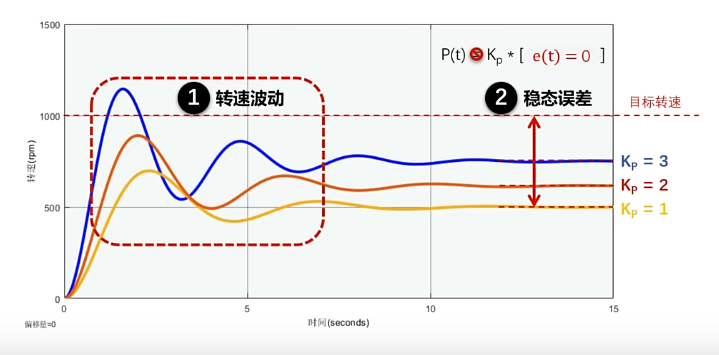
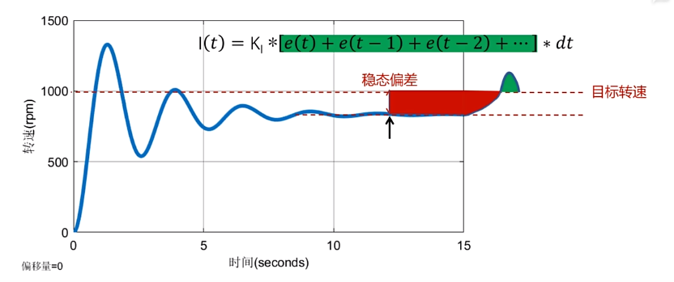
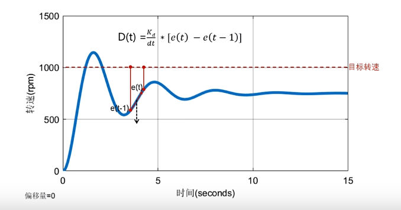

## PID controller

P: 比例控制

I: 积分控制 

D: 微分控制

PID的功能对应"快准稳"

$u(t)  = P(t) + I(t) + D(t)$ 

$u(t) = K_p*e(t) + K_I * \int_0^te(t)dt + K_d* \frac{de(t)}{dt}$

### $P(t)$:

$$
\\ e(t) = 当前值 - 目标值
\\ P(t) =K_p * e(t) 
$$

K_p越大，转速波动越陡峭

此外，当$e(t)=0$时，$P(t)=0$，因此永远无法到达目标值，这是稳态误差的问题

### $I(t)$:
$$
\\ I(t) = K_I * \int_0^te(t)dt
\\ \int_0^te(t)dt = [e(t) + e(t-1) + e(t-2) + ...] *d(t)
$$

当当前值小于目标值时,$I(t)$做正向积分,增大$u(t)$

当当前值大于目标值时,$I(t)$做负向积分,减少$u(t)$

即$I(t)$使$u(t)$不断靠近目标值,由此消除稳态误差

### $D(t)$:

$$
de(t) = e(t) - e(t-1), 即前后两帧差值
\\ D(t) =  K_d* \frac{de(t)}{dt}
$$
$D(t)$当转速靠近目标值时阻止靠近，当转速远离目标值时阻止原理，就像一个阻尼器一样

$D(t)$可以消除转速波动

